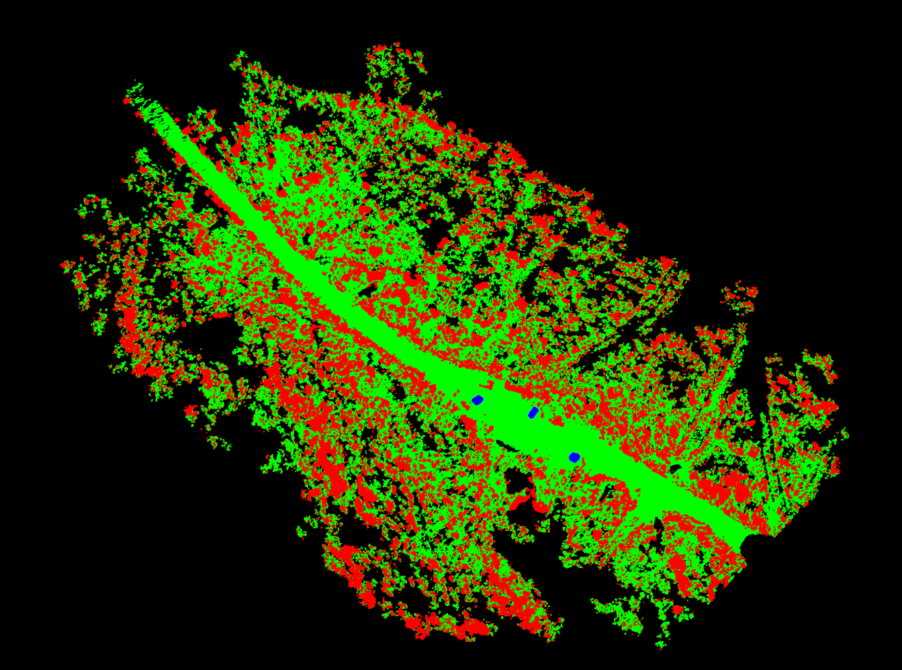
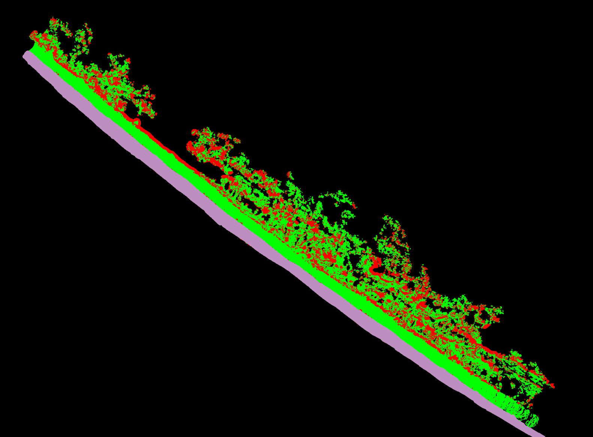
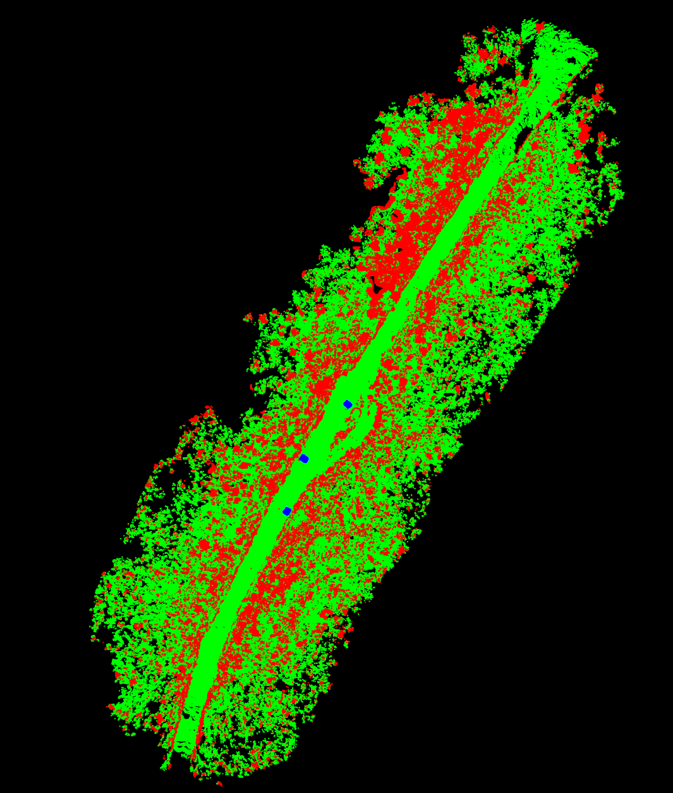
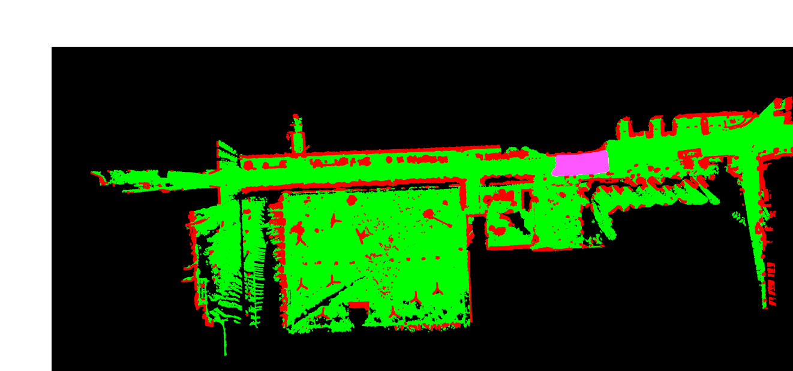
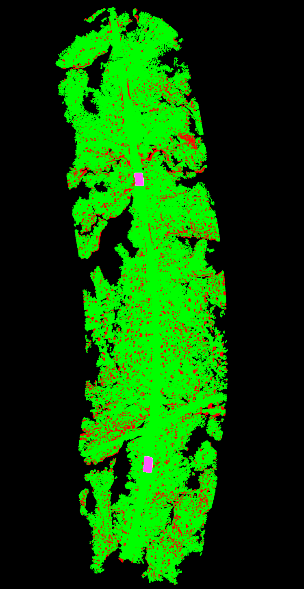

# HTD: Hazardous Terrain Detection for Off-road Autonomous Vehicles  


## Download Link on BaiDu Pan:

HTD dataset can be download [here](https://pan.baidu.com/s/1HEIk-k4fOiuqERRmoqVOPw)

链接: https://pan.baidu.com/s/1HEIk-k4fOiuqERRmoqVOPw  
提取码：f42v

Extract and organize as follows:

```
 |-- HTD
 |  |-- 01
 |  |  |-- GT_label
 |  |  |  |-- gt_label.png
 |  |  |-- LidarData
 |  |  |  |-- lidardata.pcd
 |  |  |-- Image
 |  |  |  |-- ImageData.png
 |  |  |-- params
 |  |  |  |-- lidar_specification.ini
 |  |  |-- slam_pose.txt
 |  |  |-- label_map
 |  |  |  |-- 01.png
 ......
 ......
 |  |-- 05
```

## Label Map:

### 01



### 02



### 03



### 04



### 05


